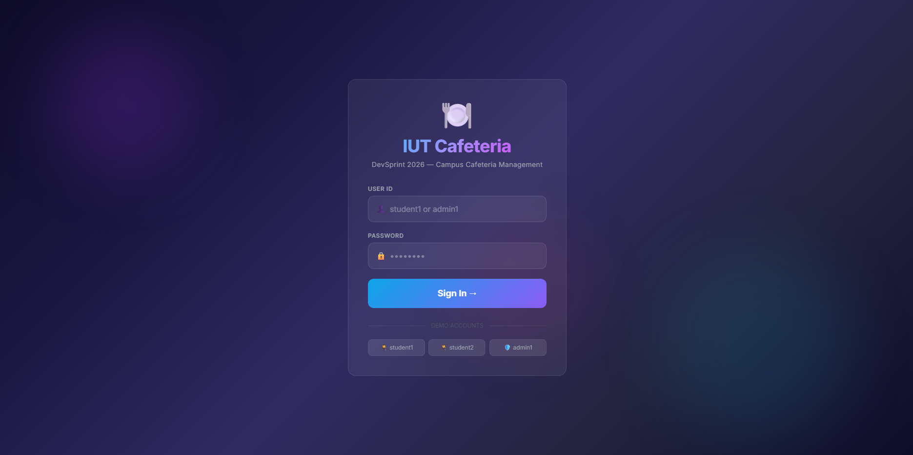
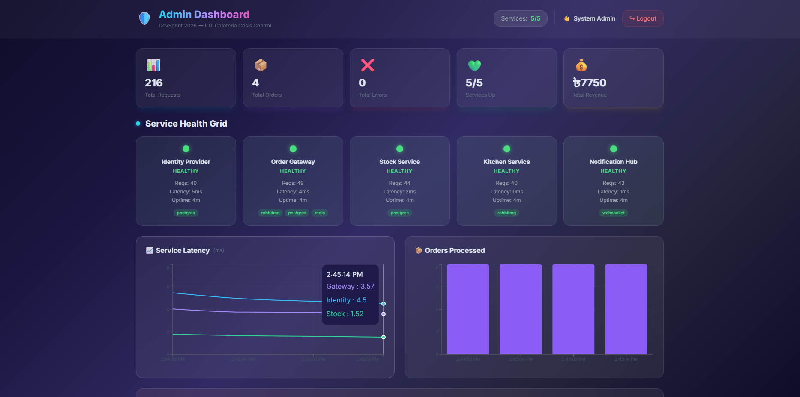
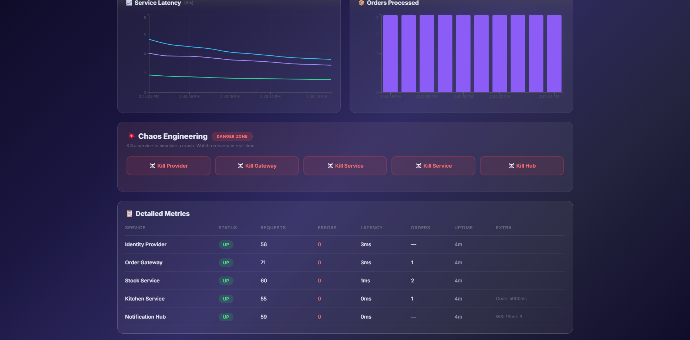
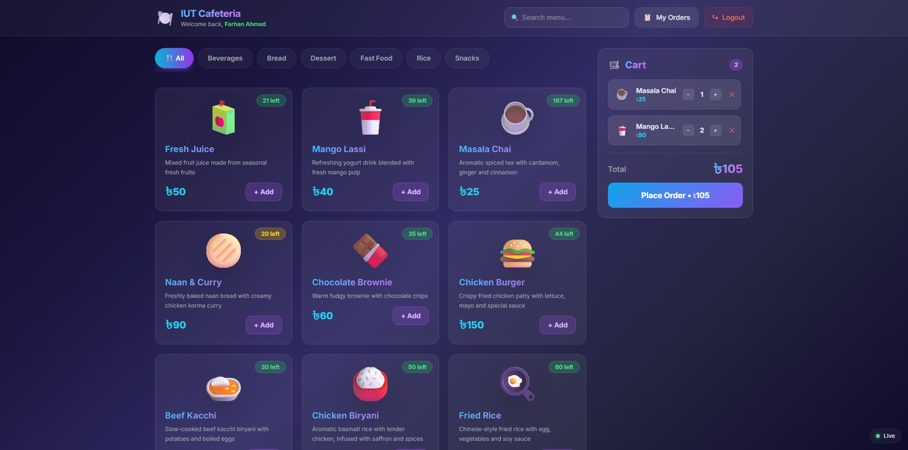
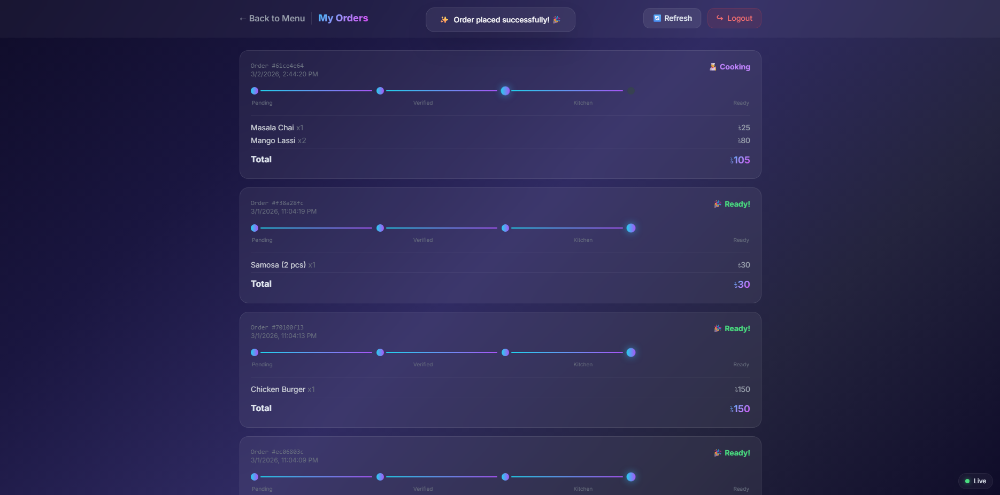

<!-- markdownlint-disable MD033 -->
# 🍽️ IUT Cafeteria Crisis — DevSprint 2026

> **Production-grade microservices system** for campus cafeteria management with real-time order tracking, chaos engineering, and full observability.

---
## 📃 Problem Statement

 🔗 [View the PDF Document](./public/DevSprint_2026_Problem_Statement.pdf)

---

## 🌐 Live Demo

The project is deployed and accessible at: **[https://iut-cafeteria-crisis-deployed.vercel.app/](https://iut-cafeteria-crisis-deployed.vercel.app/)**

---

## 🚀 Quick Start (One Command)

```bash
docker compose up --build
```
<!-- markdownlint-disable MD060 -->
| Service | URL |
|---|---|
| **Cafeteria Portal** (Student + Admin) | [http://localhost:3000](http://localhost:3000) |
| Order Gateway API | [http://localhost:8080](http://localhost:8080) |
| Identity Provider | [http://localhost:4001](http://localhost:4001) |
| Stock Service | [http://localhost:4002](http://localhost:4002) |
| Kitchen Service | [http://localhost:4003](http://localhost:4003) |
| Notification Hub | [http://localhost:4005](http://localhost:4005) |
| RabbitMQ Management | [http://localhost:15672](http://localhost:15672) (guest/guest) |
| Prometheus | [http://localhost:9090](http://localhost:9090) |

### Demo Credentials

| Role | ID | Password |
|---|---|---|
| Student | `student1` | `password123` |
| Student | `student2` | `password123` |
| Admin | `admin1` | `password123` |

---

## 🏗️ Architecture
<!-- markdownlint-disable MD033 -->

 <br>
 <br>

---

## 🏗️ Project Screenshot

<br>
<br>
<br>
<br>
<br>

---

## 🧪 Judge Quick Test Guide

### 1. Login & Place Order

```bash
# Login as student
curl -X POST http://localhost:4001/auth/login \
  -H "Content-Type: application/json" \
  -d '{"studentId":"student1","password":"password123"}'

# Save the returned accessToken, then:
curl -X POST http://localhost:8080/api/orders \
  -H "Content-Type: application/json" \
  -H "Authorization: Bearer <TOKEN>" \
  -H "Idempotency-Key: $(uuidgen)" \
  -d '{"items":[{"itemId":"item-001","name":"Chicken Biryani","quantity":2,"price":120}]}'
```

### 2. Check Health Endpoints

```bash
curl http://localhost:4001/health  # Identity Provider
curl http://localhost:4002/health  # Stock Service
curl http://localhost:8080/health  # Order Gateway
curl http://localhost:4003/health  # Kitchen Service
curl http://localhost:4005/health  # Notification Hub
```

### 3. Check Metrics (Prometheus format)

```bash
curl http://localhost:8080/metrics
```

### 4. Rate Limiting (3 attempts/min per studentId)

```bash
# Fire 4 rapid login attempts — 4th will be rate-limited
for i in $(seq 1 4); do
  echo "---Attempt $i ---"
  curl -s -X POST http://localhost:4001/auth/login \
    -H "Content-Type: application/json" \
    -d '{"studentId":"student1","password":"wrong"}'
  echo ""
done
```

### 5. Chaos Engineering

```bash
# Login as admin first
ADMIN_TOKEN=$(curl -s -X POST http://localhost:4001/auth/login \
  -H "Content-Type: application/json" \
  -d '{"studentId":"admin1","password":"password123"}' | jq -r '.accessToken')

# Kill the kitchen service
curl -X POST http://localhost:4003/chaos/kill \
  -H "Authorization: Bearer $ADMIN_TOKEN"

# Watch docker compose auto-restart it
docker compose ps
```

### 6. Idempotency Check

```bash
# Same idempotency key returns same result, stock not double-deducted
IDEM_KEY=$(uuidgen)
curl -X POST http://localhost:8080/api/orders \
  -H "Content-Type: application/json" \
  -H "Authorization: Bearer <TOKEN>" \
  -H "Idempotency-Key: $IDEM_KEY" \
  -d '{"items":[{"itemId":"item-001","name":"Chicken Biryani","quantity":1,"price":120}]}'

# Repeat with same key — should return cached result
curl -X POST http://localhost:8080/api/orders \
  -H "Content-Type: application/json" \
  -H "Authorization: Bearer <TOKEN>" \
  -H "Idempotency-Key: $IDEM_KEY" \
  -d '{"items":[{"itemId":"item-001","name":"Chicken Biryani","quantity":1,"price":120}]}'
```

---

## 📁 Repository Structure
<!-- markdownlint-disable MD040 -->
```
iut-cafeteria-crisis/
├── .github/workflows/        # CI/CD pipeline
├── clients/                  # Unified React app (Student + Admin dashboard)
├── infrastructure/
├── k8s/                      # Kubernetes manifests
├── public/                   # Images and assets
├── services/
│   ├── identity-provider/    # JWT auth, bcrypt, rate limiting
│   ├── stock-service/        # Inventory with optimistic locking
│   ├── order-gateway/        # API gateway, Redis cache, RabbitMQ
│   ├── kitchen-service/      # Async order processing via AMQP
│   └── notification-hub/     # WebSocket real-time updates
├── shared/                   # Types, middleware, DTOs
│   ├── db/                   # SQL init + seed scripts
│   └── prometheus/           # Prometheus config
└── docker-compose.yml        # Single-command orchestration
```

---

## 🎯 How We Solved the "Cafeteria Crisis"

Team codeKomAiBeshi addressed every challenge in the DevSprint 2026 Problem Statement by completely re-architecting the "Spaghetti Monolith" into a resilient, distributed system:

1. **Shattering the Monolith**: We decoupled the system into five specialized, containerized microservices (`identity-provider`, `order-gateway`, `stock-service`, `kitchen-service`, `notification-hub`), meaning if the Kitchen Service crashes, the Identity Provider stays up.
2. **Defeating the DB Lock Bottleneck**:
   - **Optimistic Locking**: The `stock-service` acts as the single source of truth, using version-based optimistic locking to prevent over-selling Biryani without freezing the DB.
   - **High-Speed Cache**: The `order-gateway` checks Redis first. If an item is out of stock in Redis, it rejects the request instantly, saving the DB from unnecessary load.
3. **Kitchen Asynchronous Processing**: The `order-gateway` acknowledges orders in milliseconds by pushing them to a **RabbitMQ** `kitchen_orders` queue. The `kitchen-service` processes them asynchronously (simulating 3-7s cook time) and updates the student via the WebSocket `notification-hub`.
4. **Fault Tolerance & Idempotency**: If a service crashes mid-request, our system is safe. Orders use UUID `Idempotency-Key` headers—preventing double-charging or double-stock reservations during retires. A `PENDING_QUEUE` auto-retry sweeps failed RabbitMQ publishes.
5. **Observability & Bonus Challenges**:
   - **Prometheus & Grafana**: We expose standard metrics (`/metrics`) to render real-time latency and order throughput on a custom Grafana dashboard.
   - **Rate Limiting**: Our `identity-provider` uses Redis to enforce a strict 3 login attempts per minute limit per student.
   - **Chaos Engineering**: A `/chaos/kill` endpoint lets judges instantly crash any service to verify UI resilience and auto-recovery.

---

## 🔑 Key Technical Features

| Feature | Implementation |
|---|---|
| **Authentication** | JWT tokens with bcrypt password hashing |
| **Rate Limiting** | 3 login attempts/min per studentId (Identity Provider) |
| **Optimistic Locking** | Version-based concurrency control in Stock Service |
| **Idempotency** | UUID-based idempotency keys in Order Gateway + Stock Service |
| **Message Queue** | RabbitMQ for async order → kitchen processing |
| **Caching** | Redis for stock level caching (30s TTL) |
| **Real-time** | WebSocket push for order status updates |
| **Observability** | Prometheus metrics + structured JSON logging + request ID tracing |
| **Chaos Engineering** | `/chaos/kill` endpoint on every service (admin-only) |
| **Resilience** | Auto-restart, PENDING_QUEUE retry, connection retry with backoff |

---

## 📊 Visualization & Monitoring

The system prioritizes observability:

- **Real-time Alerts**: The Frontend Dashboard calculates the moving average latency of requests over a 30-second window. If latency spikes (e.g., due to Chaos Engineering triggers), a visual **Red Alert** badge appears instantly.
- **Status Indicators**: "Traffic Light" indicators show the health status (UP/DOWN) of individual services.
- **Prometheus Metrics**: Each service exposes `/metrics` (RED method).
  - `http_request_duration_seconds`: Track latency percentiles.
  - `process_cpu_seconds`: Resource usage.
- **Metrics Dashboard**: A dedicated view in the frontend parses raw Prometheus data to show CPU, Memory, Heap, and Uptime in a developer-friendly grid.

---

## 🧪 Running Tests

```bash
# Order validation tests
cd services/order-gateway && npm test

# Stock deduction / idempotency tests
cd services/stock-service && npm test
```

---

## ☸️ Kubernetes Deployment

```bash
kubectl apply -f k8s/infrastructure/namespace-secrets.yaml
kubectl apply -f k8s/infrastructure/
kubectl apply -f k8s/services/
```

---

## 🛠️ Tech Stack

- **Backend:** Node.js + TypeScript + Express
- **Database:** PostgreSQL 16 (3 isolated instances)
- **Cache:** Redis 7
- **Message Queue:** RabbitMQ 3.12
- **Frontend:** React 18 + Vite + Tailwind CSS + Framer Motion + Recharts
- **Metrics:** Prometheus
- **CI/CD:** GitHub Actions
- **Containerization:** Docker + Docker Compose
- **Orchestration:** Kubernetes (manifests provided)

---

Built for **DevSprint 2026** by Team codeKomAiBeshi 🏆
